# IMC Prosperity 4 — Trading Competition

**IMC Prosperity** is a global algorithmic trading competition run by IMC Trading. Over 18,000 participants write Python bots that trade synthetic products on a simulated exchange, competing across five rounds. Each round introduces new products and market mechanics, and includes a separate manual trading challenge requiring game theory or probability.

This repository contains certain code submissions I built and much of the EDA for the competition.

I am happy to say I was able to finish top 50 in the USA for Mission 1, consisting of the first group of rounds of the competition.

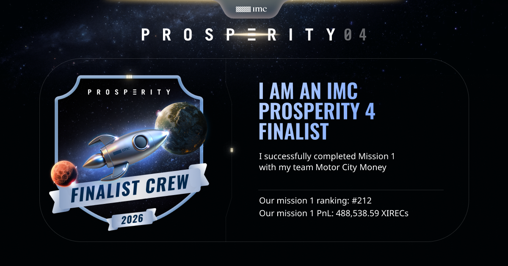

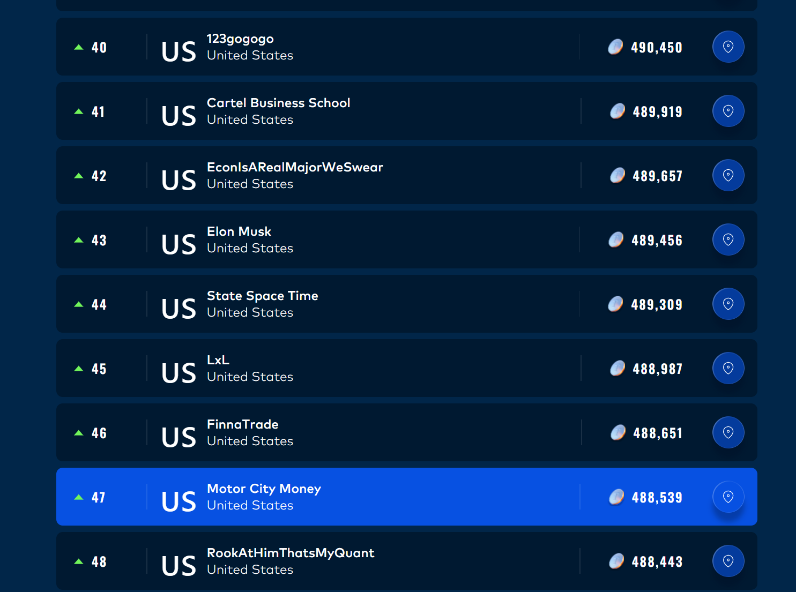

---

## Round by Round Breakdown

| Round | Algorithm Description | Manual Description |
|---|---|---|
| Round 0 | Warmup round |  |
| Round 1 | Simple product market making and mean reversion | Sealed-book auction, sweep all |
| Round 2 | Added bid for more order book access to previous round| Budget allocation game, game theory |
| Round 3 | Options strategy | Counterparty negotiation, game theory |
| Round 4 | Added access to informed traders to previous round | Exotic options portfolio |
| Round 5 | Large scale MM strategy, covariance, many assets | News headline trading|

### Round 1 — Learning to Market-Make

**Products:** Ash-Coated Osmium, Intarian Pepper Root

**Algorithmic:** The first real round introduced two products, one with mean-reverting price dynamics, and one with a significant linear drift.

One of the most useful things I did  in this competition was reconstruct the underlying fair value of the asset based on the incomplete order book. I realized that bids and orders formed in 3 layers.

[Round Submission](algo/round1/submit.py)

[Osmium Notebook](algo/round1/round1_osmium.ipynb)

[Pepper Root Notebook](algo/round1/round1_root.ipynb)

[Osmium Notebook, looking for ARIMA trends](algo/round1/round1_arima.ipynb)

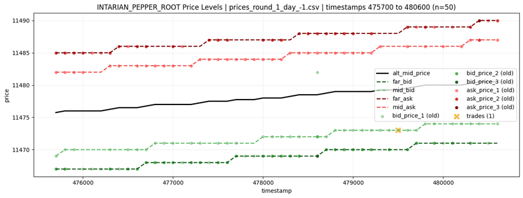

The best strategy for each asset was a form of a grid search of different parameters. For the Intarian Pepper Root that had a linearly increasing trend, the best strategy was a form of buying and holding, with some market making and market taking along the way. For the mean reverting Ash-Coated Osmium asset, a grid search with up to 15 assets at times was conducted. With each of these parameters having around 5 values to test, there were around 750,000 possible values to test. With each trial taking around 20 seconds to run, trying every possible combination would take around 175 days. A greedy local search was used, starting at various points.

**Manual:** Two products (Dryland Flax, Ember Mushroom) were auctioned in a sealed-book format. You submitted a single (price, volume) bid and the exchange found the clearing price that maximised matched volume, with last-in-queue priority at the clearing price.

I made a simulator that swept all (price, volume) combinations to build a full profit heatmap, with trading fees built in. The chart below shows increments of 1000, and later increments of 1 were calculated near the most profitable areas.

[Flax Notebook](manual/round1/flax.ipynb)

[Mushroom Notebook](manual/round1/mushroom.ipynb)

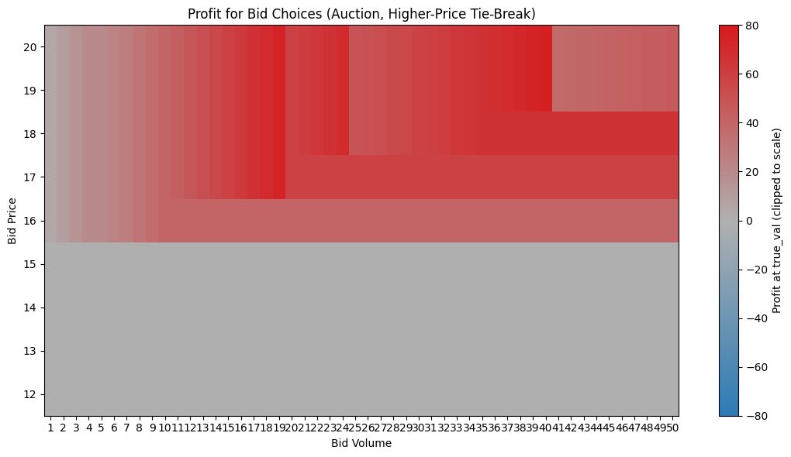

---

### Round 2 — Refining the Edge

**Products:** Ash-Coated Osmium, Intarian Pepper Root (continued)

**Algorithmic:** This round kept the same products as Round 1, but with a twist. Round 2 added the ability to place bids for direct order book access, giving the users access to more orders. My strategy from the previous round proved to be very robust, so a small amount of 500 (about 0.5% of expected algo earnings) was bid.

One of the unforeseen challenges of this round was the discontinuity between the historical data and the live trading day. As you can see in the graph below, the trading data from the actual trading day did not match the history whatsoever. This meant that backtesting may not be as useful as it seems, and trading using conceptual strategies can prove to be the most reliable strategy.

[Round Submission](algo/round2/round2-1.py)

[Round 2 Algo Notebook](algo/round2/round2.ipynb)

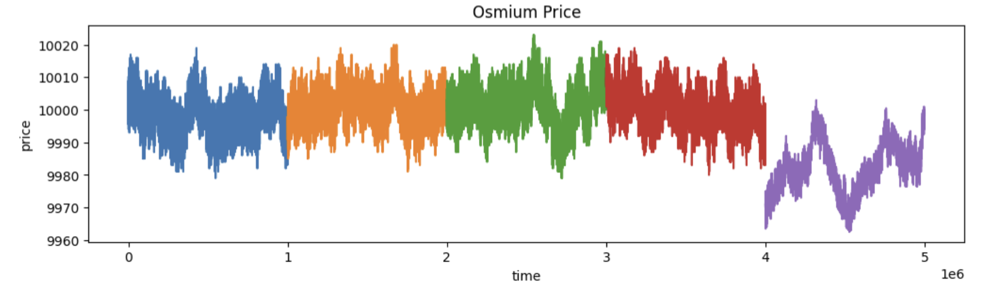

**Manual:** A budget allocation game with three multipliers: Research, Scale, and Speed. Speed was **rank-based**, so your score depended on how your allocation compared to everyone else's, making this a game theory problem rather than a pure optimization problem like round 1. I modeled the likely distribution of competitor speed allocations as a mixture distribution, derived the implied rank-score function, and ran brute-force search over all integer allocations to find the optimal split under different distributional assumptions.

[Round 2 Manual Notebook](manual/round2/round2.ipynb)

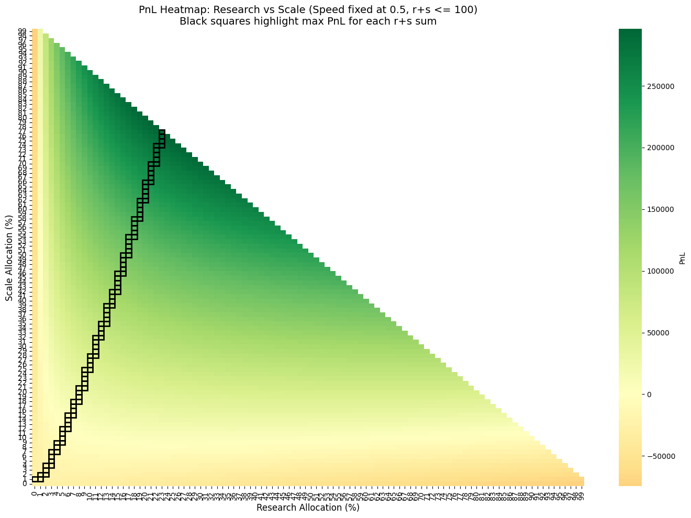
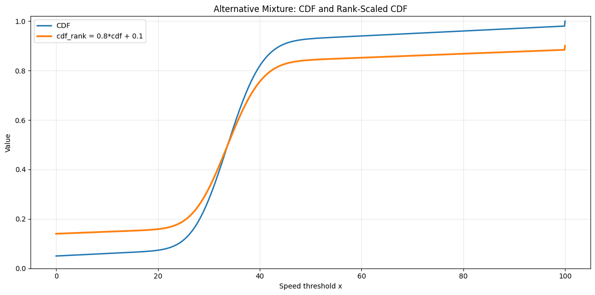
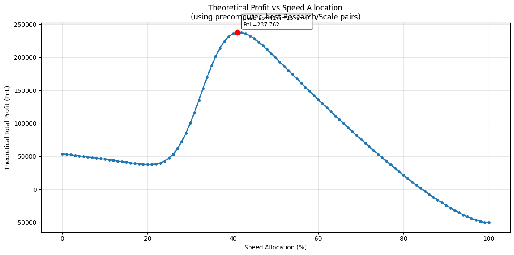

---

### Round 3 — Options Trading

**Products:** Velvetfruit Extract, 10 call option strikes (VEV\_4000 through VEV\_6500)

**Algorithmic:** This was the most technically challenging round, introducing an underlying asset alongside 10 call option contracts across different strikes. Two core strategies drove the submission. The first was fitting a volatility smile to the implied volatility at each strike, I could identify when a given option was trading rich or cheap relative to the surface and fade that deviation. The second was convergence trading. EDA revealed that certain strikes were persistently mispriced relative to the average one , either consistently trading below or above it.

The graphs below show that the options did not move together in the way a standard model would predict, with one strike exhibiting noticeably lower volatility than the rest. The second image shows the divergence of strike 5400 in particular. One important lesson from Round 2 was that live trading day data is not guaranteed to be continuous with prior history. Given how much the 5400 strike had diverged in the historical data, relying on it as a hedge in live trading may not be a reliable strategy.

[Round Submission](algo/round3/submit.py)

[Preliminary EDA](algo/round3/round3_options.ipynb)

[Fitting Smile (most useful)](algo/round3/round3_smile.ipynb)

[Scan of different alpha signals (also cool)](algo/round3/round3_alpha_scan.ipynb)

[Examining Mean Reversion and Z scores of Hydrogel](algo/round3/roumd3_hydrogel.ipynb)

[Stationarity of Velvetfruit](algo/round3/round3_velvetfruit.ipynb)

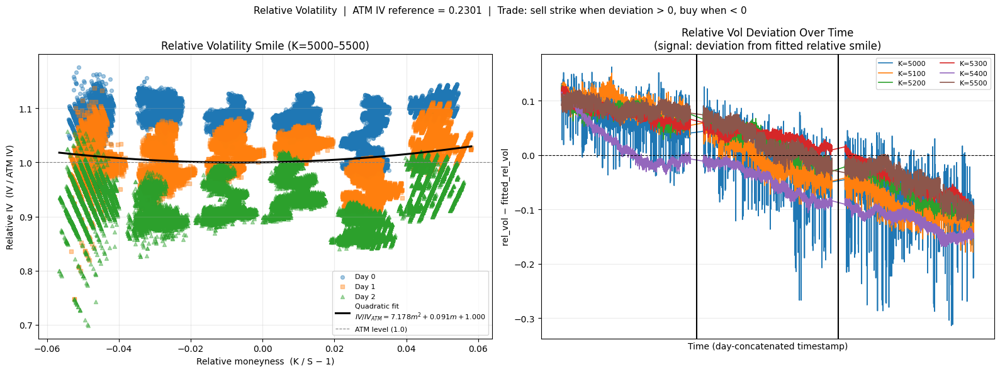
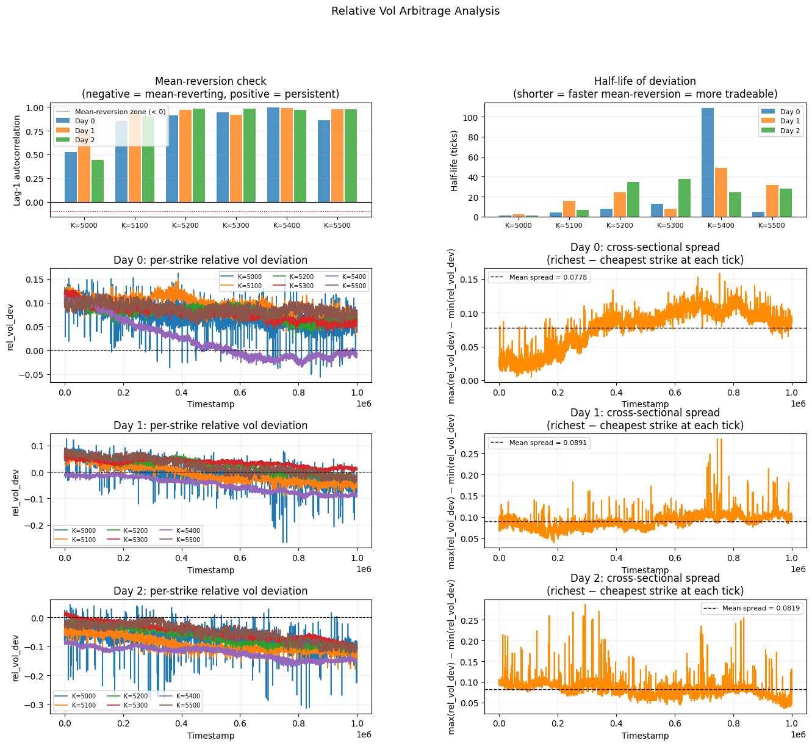

**Manual:** A counterparty negotiation game. Counterparties have a reserve price drawn uniformly from a discrete set (670 to 920 in steps of 5). If your bid meets or exceeds their reserve, you trade at your bid price, earning `920 − bid` per unit. You could place up to two bids. The first bid would be placed, the market would clear, then the second bid would be placed. The first bid acts independently from other participants, and the second bid introduced a penalty if it fell below the average of other participants' second bids (`min(1, ((920 − avg) / (920 − bid))³)`), making this a game theory problem. 

This was very similar to a round from the prior year, so much of the estimations were taken from that. Additionally, there were polls conducted on the discord to determine the expected average second bids. People did not have to answer truthfully in these polls, but I found them to be pretty accurate nonetheless. I built a widget to play with different estimates form both of these to determine the optimal bids.

[Round 3 Manual Notebook](manual/round3/round3.ipynb)

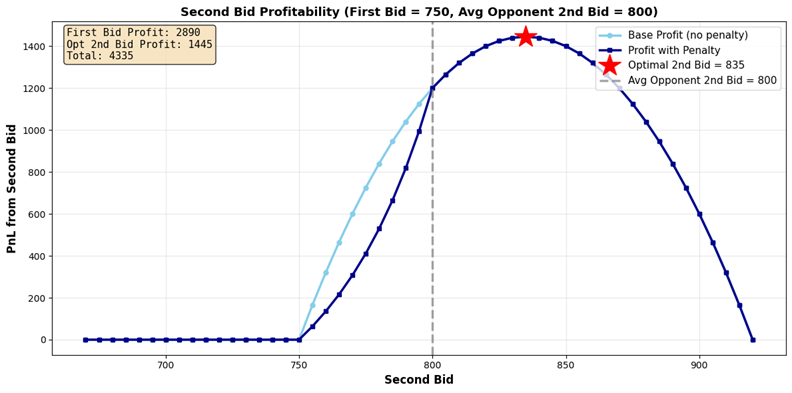
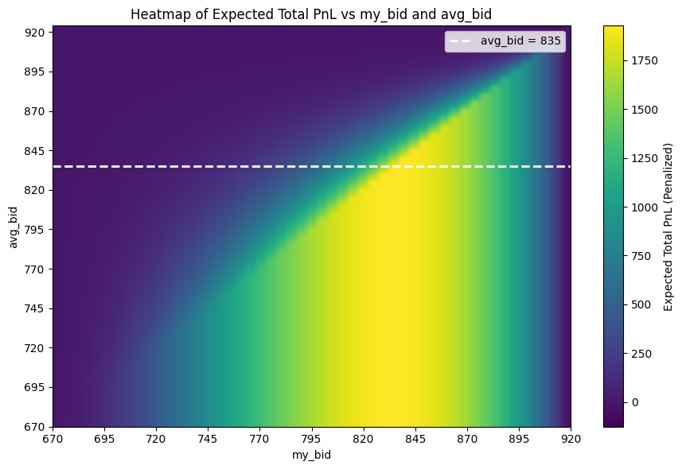

---

### Round 4 — Informed Traders

**Products:** Velvetfruit Extract (spot), 10 call strikes (VEV\_4000 through 6500)

**Algorithmic:** This round added additional information about which parties were executing the trades. Unfortunately not much was done with this information since this 48 hour round coincided with 3 finals. The EDA was interesting to see, certain traders exhibited behavior of both institutional and retail traders.

[Round Submission](algo/round4/submit.py)

[Round 4 Algo Notebook](algo/round4/round4.ipynb)

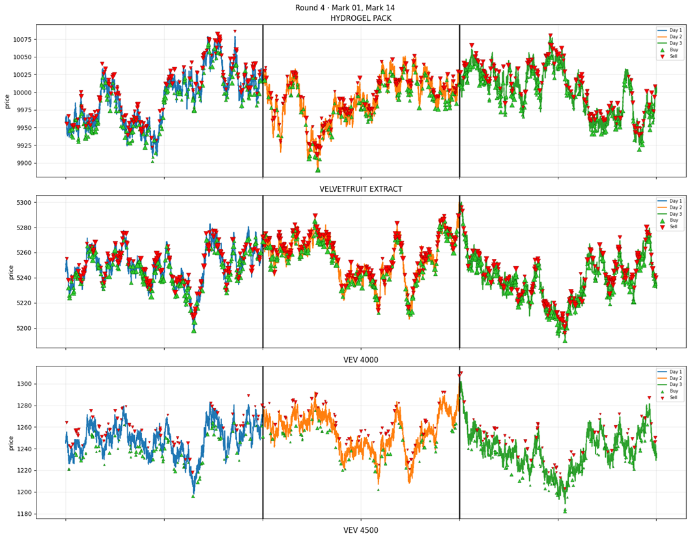

**Manual:** The round presented different exotic options on AETHER_CRYSTAL. There were vanilla calls and puts at different strikes, a chooser option, a binary put, and a knockout put, and asked you to construct a portfolio from them. I used Monte Carlo simulation of 10,000 GBM price paths over the option horizon, pricing each contract by averaging its payoff across all paths. This gave a model fair value for every instrument, which I compared against the market prices to identify edges.

The harder part of this problem was determining how to balance excpeced value with risk. It was unclear if we would be evaluated solely on expected value or if it would be a single random path. I decided to use a balanced approach with lower variance and positive expected value at every price point, at the cost of a slightly lower total expected risk. This approach aimed to limit Value at Risk as much as possible.

Below are an image of the payoff of every option and the underlying asset, and an analysis of the monte carlo approach that was taken and the payoffs of each asset

[Round 4 Manual Notebook](manual/round4/round4.ipynb)

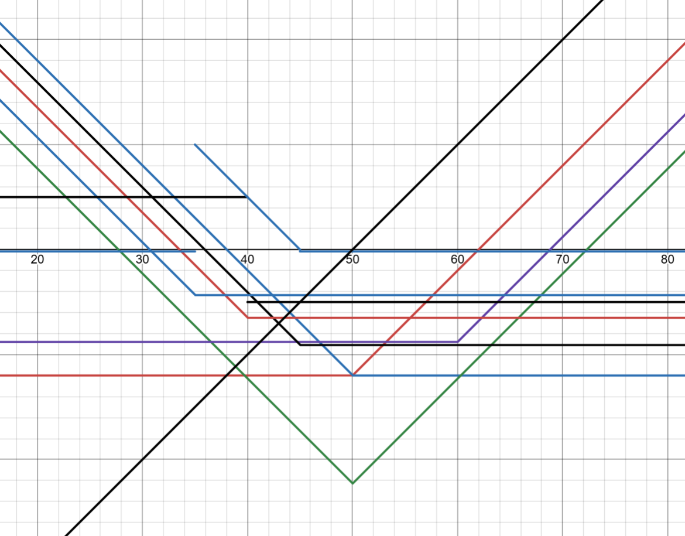
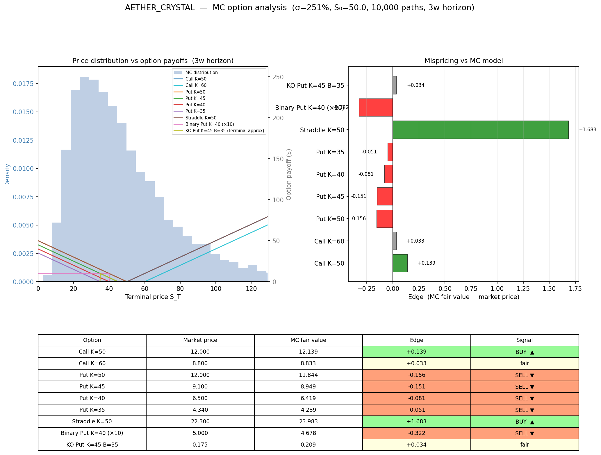
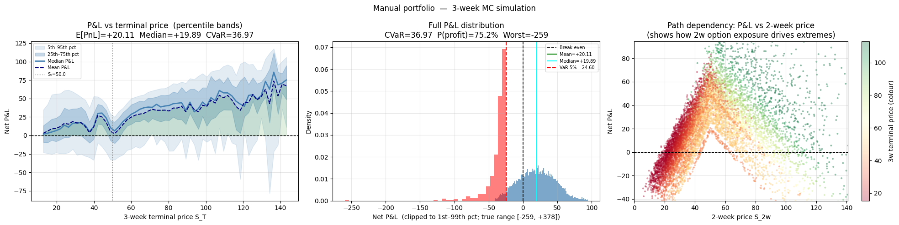

---

### Round 5 — Industrial Scale Market Making

**Products:** ~50 products across 10 product families

**Algorithmic:** The final round access to fifty products, all with thin order books and small position limits. Assets were categorized into groups of 5 based on similar attributes. Some asset groups have no discernible connections while others had underlying patterns.

I plotted the covariance matrices of each asset as well as their granger causality scores. Snackpack and Pebbles showed correlation structures that could be traded upon, as well as some pairs of assets in other groups. I traded these assets by market making, longing and shorting certain assets, and trading on mean reversion for pairs of other assets.

[Round Submission](algo/round5/r5_mm_l_s.py)

[Round 5 Algo Notebook](algo/round4/round4.ipynb)

[Round 5 Granger Causality Notebook](algo/round5/round5_granger.ipynb)

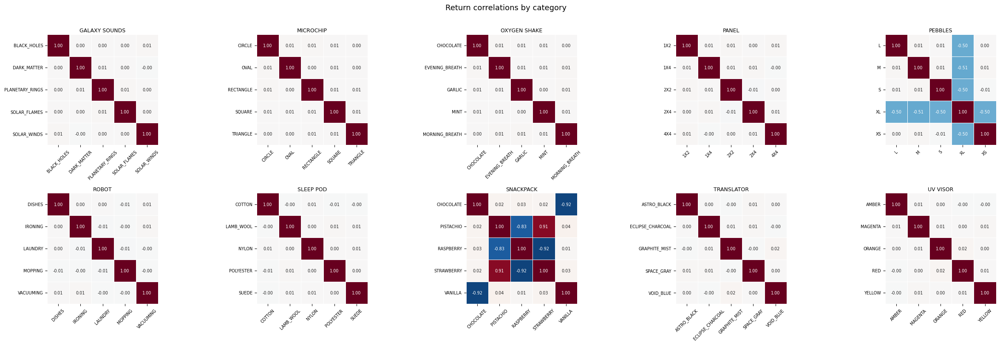
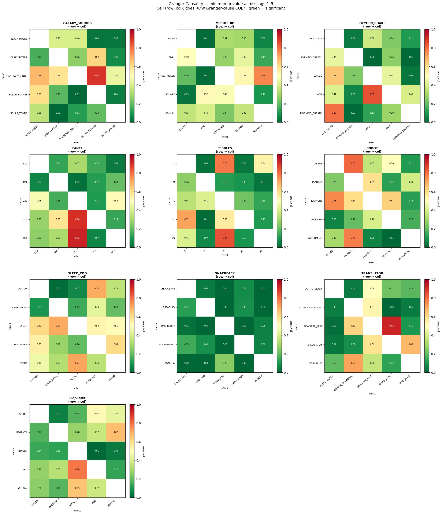

**Manual:** News headline trading. This challenge asked participants to buy or sell different assets based on an excerpt from a news article. We were tasked with determining the sentiment from each article to gauge if the price would likely go up or down and trade on that.

No notebook for this manual round.

## Skills Demonstrated

| Area | What was built |
|---|---|
| Market microstructure | Order book reconstruction, spread quoting, position limit management |
| Derivatives pricing | Black-Scholes from scratch (pricing, IV inversion, delta), smile fitting |
| Time series analysis | ARIMA forecasting, rolling signals, mean reversion detection |
| Statistical modelling | Mixture distributions, Granger causality, covariance analysis |
| Game theory | Rank-based optimization under distributional uncertainty |
| Auction theory | Sealed-book clearing price simulation, profit sweep analysis |
| Systems | Stateful bots (persisting data across ticks), iterative strategy refinement |
